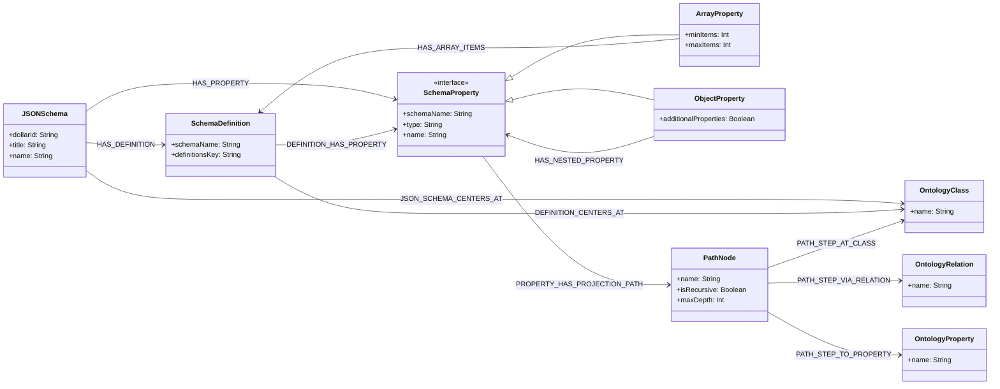

# Graph Projection Reshaper — Architecture

**Version:** 1.0.0
**Status:** Proposed
**Date:** 2026-03-08
**Author:** Winston (Architect) + Graph Consistency Guardian

## 1. Problem Statement

Rankellix stores legal directory submission data in a **normalized graph ontology** — entities like Firm, Department, People, Matter, and Submission are interconnected through typed relations. Five external directories (Chambers, Legal 500, Leaders League, ITR World Tax, IFLR1000) each define **distinct JSON schemas** for their submission formats.

Today, transforming between these representations requires hand-coded scripts per directory, with flat `MAPS_TO` relations that encode source/destination paths as strings in edge properties. This approach:

- Proliferates fix scripts (`fix-*-mappings.mjs`, `cleanup-*-mappings.mjs`)
- Cannot be validated structurally by the graph
- Does not reuse the proven **PathNode traversal pattern** from the Dynamic UI ontology
- Requires code changes for every schema revision

## 2. Architectural Insight

The Dynamic UI ontology already solves an analogous problem: given a center entity, traverse the graph through ordered PathNode chains to collect data and present it in a target structure (tables, forms). The same pattern — **ordered path chains from a center entity to leaf properties** — can drive bidirectional transformation between the Rankellix graph and external JSON schemas.

The JSONSchemaOntology already models JSON Schema documents as graph data (JSONSchema, SchemaDefinition, SchemaProperty hierarchy). By connecting SchemaProperty nodes to PathNode chains, the graph itself becomes the mapping specification — no scripts, no string paths, no code changes for new schemas.

## 3. Design Principles

1. **Reuse PathNode** — No new traversal class. PathNode with PATH_STEP_VIA_RELATION, PATH_STEP_AT_CLASS, PATH_STEP_TO_PROPERTY is sufficient.
2. **Graph-as-specification** — The mapping lives in Neo4j, not in code. Change the graph, regenerate.
3. **Bidirectional by default** — The same path chain describes both export (graph → JSON) and import (JSON → graph).
4. **Array detection from cardinality** — 0:N relations in the path produce arrays. ArrayProperty in the JSONSchemaOntology confirms expected shape.
5. **One generic generator** — Data-driven, not schema-specific. Works for all 5 directories (and future ones) without code changes.

## 4. New Relations (3)

### 4.1 JSON_SCHEMA_CENTERS_AT

| Attribute | Value |
|---|---|
| Source | JSONSchema |
| Destination | OntologyClass |
| Cardinality | 0:1 |
| Edge Properties | — |
| Ontology | JSONSchemaOntology |
| Purpose | Declares the root Rankellix entity class for a schema document |

**Example:** ITR World Tax 2027 schema → Submission

The center class is the starting point for all path traversals within this schema. For ITR, every path fans out from the Submission node.

### 4.2 DEFINITION_CENTERS_AT

| Attribute | Value |
|---|---|
| Source | SchemaDefinition |
| Destination | OntologyClass |
| Cardinality | 0:1 |
| Edge Properties | — |
| Ontology | JSONSchemaOntology |
| Purpose | Declares the Rankellix entity class for a schema definition, when it differs from the schema root |

**Example:** Within the ITR schema, a "deal_highlight" definition → Matter

When a SchemaDefinition maps to a different entity than the parent JSONSchema, this relation overrides the root. If absent, the definition inherits the schema-level center.

### 4.3 PROPERTY_HAS_PROJECTION_PATH

| Attribute | Value |
|---|---|
| Source | SchemaProperty (and all subtypes: StringProperty, ObjectProperty, ArrayProperty, etc.) |
| Destination | PathNode |
| Cardinality | 0:N |
| Edge Properties | `ord: Int`, `isFirst: Boolean`, `isLast: Boolean` |
| Ontology | JSONSchemaOntology |
| Purpose | Ordered traversal path from center entity to the Rankellix data that feeds (or is fed by) this schema property |

**Example:** `firmInfo.firm_name` SchemaProperty:
```
SchemaProperty("firm_name")
  ──PROPERTY_HAS_PROJECTION_PATH (ord:0, isFirst:true)──▶ PathNode₁
      PATH_STEP_VIA_RELATION → DEPARTMENT_HAS_SUBMISSION (reverse)
      PATH_STEP_AT_CLASS → Department
  ──PROPERTY_HAS_PROJECTION_PATH (ord:1)──▶ PathNode₂
      PATH_STEP_VIA_RELATION → HAS_DEPARTMENT (reverse)
      PATH_STEP_AT_CLASS → LegalFirm
  ──PROPERTY_HAS_PROJECTION_PATH (ord:2, isLast:true)──▶ PathNode₃
      PATH_STEP_TO_PROPERTY → firmName
```

This mirrors COLUMN_HAS_PATH exactly. The edge `ord` maintains traversal order. `isFirst`/`isLast` enable fast boundary detection.

## 5. Reused Ontology Elements

| Element | Original Purpose | Reused For |
|---|---|---|
| **PathNode** class | UI column/field data binding | Schema projection traversal steps |
| **PATH_STEP_VIA_RELATION** | Relation traversed at a UI path step | Relation traversed at a projection step |
| **PATH_STEP_AT_CLASS** | Target class at a UI path step | Target class at a projection step |
| **PATH_STEP_TO_PROPERTY** | Leaf property for UI display | Leaf property for JSON value read/write |
| **OntologyRelation cardinality** | Query building (nested vs. direct) | Array detection (0:N = JSON array) |
| **JSONSchema** class | Schema-as-data storage | Export target / import source document |
| **SchemaDefinition** class | $defs/definitions modeling | Sub-entity projection roots |
| **SchemaProperty** hierarchy | Schema structure modeling | Projection path anchors |
| **ArrayProperty → HAS_ARRAY_ITEMS → SchemaDefinition** | Array item type reference | Array sub-entity detection |

## 6. Generator Architecture

### 6.1 Export Flow (Rankellix → JSON)

```
                                    ┌─────────────────────┐
                                    │    JSONSchema        │
                                    │  (per directory)     │
                                    └────────┬────────────┘
                                             │ JSON_SCHEMA_CENTERS_AT
                                             ▼
                                    ┌─────────────────────┐
                                    │   OntologyClass      │
                                    │   (center entity)    │
                                    └────────┬────────────┘
                                             │
              ┌──────────────────────────────┼──────────────────────────────┐
              │                              │                              │
    SchemaProperty₁              SchemaProperty₂                SchemaProperty₃
    (firmInfo.firm_name)         (section_1.key_practitioners)  (section_2[].title)
              │                              │                              │
    PROPERTY_HAS_PROJECTION_PATH  PROPERTY_HAS_PROJECTION_PATH  PROPERTY_HAS_PROJECTION_PATH
              │                              │                              │
    PathNode chain               PathNode chain                 PathNode chain
    [→Dept→Firm.firmName]        [→Dept→People[]]               [→Dept→Matter[].mTitle]
```

**Steps:**
1. Resolve JSONSchema → JSON_SCHEMA_CENTERS_AT → center OntologyClass
2. Collect all SchemaProperty nodes (via HAS_PROPERTY, DEFINITION_HAS_PROPERTY, HAS_NESTED_PROPERTY recursion)
3. For each SchemaProperty with PROPERTY_HAS_PROJECTION_PATH:
   a. Walk PathNode chain (ordered by `ord`)
   b. Build GraphQL query fragment (reuse `queryBuilder.configToFields` pattern)
   c. Merge shared path prefixes (deduplication)
4. Execute composed GraphQL query against Rankellix data
5. Reshape response: map each leaf value to its SchemaProperty position in output JSON
6. Validate output against JSONSchema (schema-as-data enables runtime validation)
7. Write to directory output path

### 6.2 Import Flow (JSON → Rankellix)

**Steps:**
1. Parse input JSON document
2. Resolve JSONSchema → JSON_SCHEMA_CENTERS_AT → center OntologyClass
3. For each SchemaProperty with PROPERTY_HAS_PROJECTION_PATH:
   a. Read value from JSON at SchemaProperty position
   b. Walk PathNode chain to determine target entity + property
   c. Build GraphQL mutation (create or update)
4. Execute mutations (ordered: create entities before linking them)
5. Validate graph state post-import

### 6.3 Array Handling

When a PathNode step traverses a relation with 0:N cardinality:

- **Export:** The query returns an array. The generator wraps results in a JSON array. If the target SchemaProperty is an ArrayProperty, its HAS_ARRAY_ITEMS → SchemaDefinition provides the item schema. Each item's properties have their own PROPERTY_HAS_PROJECTION_PATH chains (relative to the array element entity).

- **Import:** The generator iterates over the JSON array. For each item, it resolves or creates the target entity and follows the sub-paths.

### 6.4 Reverse Traversal

Some paths traverse relations in reverse (e.g., from Submission ← DEPARTMENT_HAS_SUBMISSION ← Department means starting at Submission and following DEPARTMENT_HAS_SUBMISSION inbound). The PathNode already captures this via PATH_STEP_VIA_RELATION pointing to the OntologyRelation, which has RELATION_SOURCE and RELATION_DESTINATION. The generator checks traversal direction:

- If PATH_STEP_AT_CLASS matches RELATION_DESTINATION → forward traversal
- If PATH_STEP_AT_CLASS matches RELATION_SOURCE → reverse traversal

No additional modeling needed.

## 7. Integration with Existing Systems

### 7.1 Dynamic UI (App Tree)

The generator coexists with the Dynamic UI. PathNode instances used for projection paths are distinct from those used for UI binding (different incoming relations: PROPERTY_HAS_PROJECTION_PATH vs. COLUMN_HAS_PATH/FIELD_HAS_PATH). The same PathNode instance **could** be shared if a UI column and a schema property happen to traverse the same path, but this is not required.

### 7.2 AIWorkflow (ai-workflow submodule)

The generator is registered as a task in the ai-workflow submodule. Execution can be triggered by:
- Manual invocation (CLI)
- AIWorkflow Step → Prompt that invokes the generator
- Scheduled export pipeline

### 7.3 Existing MAPS_TO Relations

The flat MAPS_TO and DEFINITION_MAPS_TO relations become **redundant** once projection paths are fully populated. Migration path:

1. Create PROPERTY_HAS_PROJECTION_PATH chains for all mapped properties
2. Validate: compare generator output with existing script output
3. Deprecate MAPS_TO edge property paths (sourcePath, destinationPath)
4. Optionally retain MAPS_TO for audit trail / confidence metadata

## 8. Data Model Diagram



## 9. Validation Strategy

| Check | Method |
|---|---|
| Path continuity | Each PathNode chain: step N's PATH_STEP_AT_CLASS must be a valid source/destination of step N+1's PATH_STEP_VIA_RELATION |
| Leaf completeness | Every SchemaProperty with PROPERTY_HAS_PROJECTION_PATH must have exactly one leaf PathNode with PATH_STEP_TO_PROPERTY |
| Cardinality match | If path traverses 0:N relation, target SchemaProperty must be ArrayProperty (or inside one) |
| Schema coverage | Every required SchemaProperty in the JSONSchema must have a projection path |
| Round-trip integrity | Export then import produces identical graph state |
| Center class existence | JSON_SCHEMA_CENTERS_AT and DEFINITION_CENTERS_AT must point to classes that exist in RankellixSubmissions or related ontologies |

## 10. Implementation Phases

### Phase 1: Model Relations in Neo4j — COMPLETE (2026-03-08)
- [x] JSON_SCHEMA_CENTERS_AT, DEFINITION_CENTERS_AT, PROPERTY_HAS_PROJECTION_PATH exist in Neo4j
- [x] RELATION_SOURCE/DESTINATION correctly wired for all 3
- [x] Edge properties (ord, isFirst, isLast) on PROPERTY_HAS_PROJECTION_PATH
- [x] GraphQL schema generated — all SchemaProperty subtypes have `propertyHasProjectionPath`
- [x] PathNode has `propertyHasProjectionPathFrom` incoming
- [x] Server operational on port 4000

### Phase 2: Populate ITR Projection Paths
- Wire JSON_SCHEMA_CENTERS_AT for ITR → Submission
- Create PathNode chains for each ITR SchemaProperty using the mapping in `dynamic-rankellix-executor/itr-projection-mapping.md`
- Validate path continuity and coverage

### Phase 3: Build Generic Generator
- Export: Walk projection paths → build GraphQL query → reshape response → validate → write JSON
- Import: Parse JSON → walk paths in reverse → build mutations → execute → validate
- Reuse `queryBuilder` patterns from App Tree

### Phase 4: Remaining Directories
- Repeat Phase 2 for Chambers, Legal 500, Leaders League, IFLR1000
- Each directory only requires new graph data (PathNode chains), no code changes

### Phase 5: Deprecate MAPS_TO String Paths
- Compare generator output with legacy scripts
- Remove fix/cleanup scripts
- Optionally retain MAPS_TO for audit metadata

## 11. Open Items

| # | Item | Status |
|---|---|---|
| 1 | DepartmentInformation has no properties — `general_practice_overview` has nowhere to land | Needs ontology update |
| 2 | Jurisdictions — ITR asks for jurisdiction_1/jurisdiction_2, no clean Department→Region path | Needs new relation or derivation rule |
| 3 | section_2 array item SchemaDefinition may be missing from JSON schema import | Needs verification |
| 4 | Composite properties (e.g., `People.firstName` + `People.surname` → `research_contact.name`) | Needs transformation rule on edge or derived property |
| 5 | Filtered paths (e.g., People with `role=researchContact`) | PathNode may need filter property or separate relation |

## 12. References

- **ITR Projection Mapping:** `dynamic-rankellix-executor/itr-projection-mapping.md`
- **PathNode Schema:** `visionQuest/AppTree/generated/docs/classes/PathNode.md`
- **JSONSchemaOntology:** `visionQuest/AppTree/generated/docs/ontologies/JSONSchemaOntology.md`
- **Dynamic UI Query Builder:** `visionQuest/AppTree/_visionquest/app-tree/src/lib/queryBuilder.ts`
- **Row Flattener (inspiration):** `visionQuest/AppTree/_visionquest/app-tree/src/lib/rowFlattener.ts`
- **Existing MAPS_TO scripts:** `dynamic-rankellix-executor/review-scripts.md`
