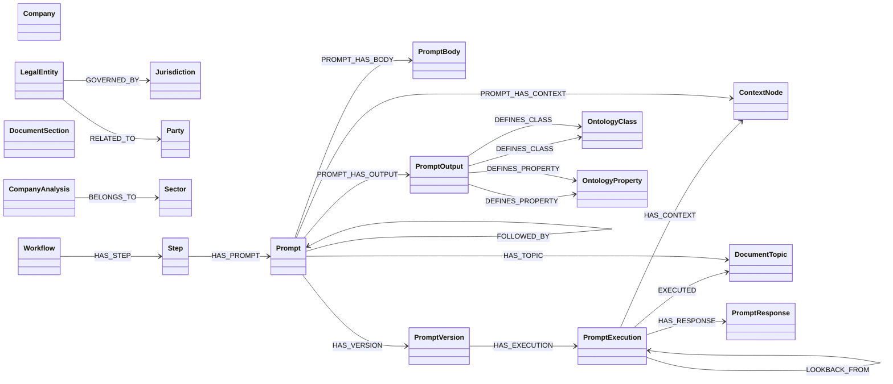

<!--
  AUTO-GENERATED by graphoogy from Neo4j meta-ontology. DO NOT EDIT.
  WARNING TO AI AGENTS: Do not modify this file under any circumstance.
  Edits will be overwritten on next `npm run generate`.
  To change content, update the source data in Neo4j and re-run the generator.
-->
# AIWorkflow

AI Workflow Execution Architecture — Structured prompt execution with schema-enforced LLM outputs, execution tracking, LOOKBACK chaining, and dynamic ontology node creation from LLM responses

**Version:** 4.0

## 1. Overview

### 1.1 Ontology Identity

| Property | Value |
|----------|-------|
| **Name** | AIWorkflow |
| **Acronym** | N/A |
| **Version** | 4.0 |
| **Status** | N/A |
| **Release Date** | N/A |
| **Organization** | N/A |
| **Authors** | N/A |

### 1.2 Purpose & Scope

**Purpose:** Model the AI prompt execution pipeline: prompt definitions, structured output schemas, execution lifecycle, and prompt chaining

**Use Cases:**
*No use cases defined.*

**In Scope:**
*No in-scope concepts defined.*

**Out of Scope:**
*No out-of-scope concepts defined.*

### 1.3 Target Audience

*No target audience defined.*

## 2. Ontology Metadata

### 2.1 Namespaces & Prefixes

*No namespaces defined.*

### 2.2 Licensing & Governance

**License:** N/A

**Governance Model:** N/A

**Contribution Guidelines:** N/A

## 3. Conceptual Model

### 3.1 Domain Description

*No domain description provided.*

### 3.2 Core Concepts

*No core concepts defined.*

### 3.3 Conceptual Diagram

## 4. Class Hierarchy

### 4.1 Top-Level Classes

| Class | Description |
|-------|-------------|
| [Company](../classes/Company.md) | A business entity with name and web presence |
| [CompanyAnalysis](../classes/CompanyAnalysis.md) | Analysis results produced for a company by an LLM execution |
| [ContextNode](../classes/ContextNode.md) | Context data injected into a prompt execution for enrichment. Supports LOOKBACK (reuse prior execution results), DOCUMENT (external document content), and NO_CONTEXT types. Enables prompt chaining by passing results from one execution as context to the next. |
| [DocumentSection](../classes/DocumentSection.md) | A section extracted from a document by the LLM |
| [DocumentTopic](../classes/DocumentTopic.md) | A topic or concept extracted from a document |
| [Jurisdiction](../classes/Jurisdiction.md) | A legal jurisdiction classification |
| [LegalEntity](../classes/LegalEntity.md) | A legal entity extracted from a legal document |
| [Party](../classes/Party.md) | A legal or business party identified in documents |
| [Prompt](../classes/Prompt.md) | A prompt definition/template with variables. Entry point of the AI workflow execution pipeline. Contains the template text, variable definitions, and version info. Prompts can be linked sequentially via FOLLOWED_BY for workflow chaining. |
| [PromptBody](../classes/PromptBody.md) | Content body of a prompt template. Contains the actual prompt text, relationship type for context linking, and node type classification. |
| [PromptExecution](../classes/PromptExecution.md) | Tracks the full lifecycle of a prompt execution against an LLM. Records request/response payloads, execution status, context type (LOOKBACK/DOCUMENT/NO_CONTEXT), created ontology nodes, and dynamic relationships. Supports chaining via LOOKBACK_FROM for multi-step prompt workflows. |
| [PromptOutput](../classes/PromptOutput.md) | Schema definition (v4.0) for structured LLM output. Defines the expected class label and properties that an LLM response should produce. Acts as a contract between the prompt and the ontology creation service, enabling JSON Schema validation of responses. |
| [PromptResponse](../classes/PromptResponse.md) | Stored LLM response for a prompt execution. Contains the raw response data from the language model, validated against the PromptOutput JSON Schema contract. |
| [PromptVersion](../classes/PromptVersion.md) | Versioned instance of a Prompt with active/inactive status. Executions link here. |
| [Sector](../classes/Sector.md) | An industry or business sector classification |
| [Step](../classes/Step.md) | A discrete stage within a Workflow that groups related Prompts for a specific task. Steps are ordered within their parent workflow. |
| [Workflow](../classes/Workflow.md) | A top-level container for a sequence of Steps that define an AI execution pipeline. Each workflow orchestrates multiple steps in order (e.g., ImportMatter workflow with QA and Summarization steps). |

## 5. Object Properties

### 5.1 Summary

| Relation | Domain | Range | Description |
|----------|--------|-------|-------------|
| [BELONGS_TO](../relations/BELONGS_TO.md) | CompanyAnalysis | Sector | Classification relationship linking an entity to its sector or category |
| [DEFINES_CLASS](../relations/DEFINES_CLASS.md) | PromptOutput | OntologyClass | Links a PromptOutput schema to the OntologyClass it defines. The LLM response creates instances of this class. |
| [DEFINES_CLASS](../relations/DEFINES_CLASS.md) | PromptOutput | OntologyClass | Links a PromptOutput schema to the OntologyClass it defines. The LLM response creates instances of this class. |
| [DEFINES_PROPERTY](../relations/DEFINES_PROPERTY.md) | PromptOutput | OntologyProperty | Links a PromptOutput schema to the OntologyProperties it defines. Each property specifies name, type, required flag, and optional relationship metadata. |
| [DEFINES_PROPERTY](../relations/DEFINES_PROPERTY.md) | PromptOutput | OntologyProperty | Links a PromptOutput schema to the OntologyProperties it defines. Each property specifies name, type, required flag, and optional relationship metadata. |
| [EXECUTED](../relations/EXECUTED.md) | PromptExecution | DocumentTopic | Links a PromptExecution to the domain nodes it created |
| [FOLLOWED_BY](../relations/FOLLOWED_BY.md) | Prompt | Prompt | Sequential workflow link between Prompts. Defines the execution order in a prompt chain, enabling multi-step AI workflows. |
| [GOVERNED_BY](../relations/GOVERNED_BY.md) | LegalEntity | Jurisdiction | Links a legal entity to its governing jurisdiction |
| [HAS_CONTEXT](../relations/HAS_CONTEXT.md) | PromptExecution | ContextNode | Links a PromptExecution to its context data. The context type (LOOKBACK/DOCUMENT/NO_CONTEXT) determines how context is resolved and injected into the prompt. |
| [HAS_EXECUTION](../relations/HAS_EXECUTION.md) | PromptVersion | PromptExecution | Links a PromptVersion to its execution records. Each execution tracks the full lifecycle of running a specific prompt version against an LLM. |
| [HAS_PROMPT](../relations/HAS_PROMPT.md) | Step | Prompt | Links a Step to its Prompts. A step may contain multiple prompts. |
| [HAS_RESPONSE](../relations/HAS_RESPONSE.md) | PromptExecution | PromptResponse | Links a PromptExecution to the LLM response it received. Contains the raw and validated response data. |
| [HAS_STEP](../relations/HAS_STEP.md) | Workflow | Step | Links a Workflow to its constituent Steps. Steps are ordered stages within a workflow. |
| [HAS_TOPIC](../relations/HAS_TOPIC.md) | Prompt | DocumentTopic | Links a Prompt to DocumentTopic nodes created from its executions |
| [HAS_VERSION](../relations/HAS_VERSION.md) | Prompt | PromptVersion | Links a Prompt to its versioned instances. Each version tracks status (active/inactive) and content. |
| [LOOKBACK_FROM](../relations/LOOKBACK_FROM.md) | PromptExecution | PromptExecution | Self-referential chain link from a PromptExecution to its predecessor. Enables LOOKBACK context where results from a prior execution are reused as input for the current one. |
| [PROMPT_HAS_BODY](../relations/PROMPT_HAS_BODY.md) | Prompt | PromptBody | Links a Prompt to its body content containing the template text and execution configuration |
| [PROMPT_HAS_CONTEXT](../relations/PROMPT_HAS_CONTEXT.md) | Prompt | ContextNode | Links a Prompt to its context configuration for execution |
| [PROMPT_HAS_OUTPUT](../relations/PROMPT_HAS_OUTPUT.md) | Prompt | PromptOutput | Links a Prompt to its structured output schema definition (PromptOutput v4.0) |
| [RELATED_TO](../relations/RELATED_TO.md) | LegalEntity | Party | Bidirectional relationship between a legal entity and a party |

## 6. Data Properties

*No data properties defined.*

## 7. Individuals

### 7.1 Named Individuals

*No named individuals defined.*

## 8. Axioms & Constraints

### 8.1 Logical Axioms

*No logical axioms defined.*

### 8.2 Constraints & Validation

*No constraints defined.*

## 9. Reasoning & Inference

### 9.1 Supported Reasoning

*No supported reasoning defined.*

### 9.2 Example Inferences

*No example inferences provided.*

## 10. Alignment & Reuse

### 10.1 Imported Ontologies

*No imported ontologies.*

### 10.2 Mappings & Alignments

*No OWL mappings defined.*

## 11. Naming Conventions

*No naming conventions defined.*

## 12. Versioning & Change Log

**Versioning Strategy:** N/A

### Change Log

*No change log entries.*

## 13. Access & Distribution

### 13.1 Repository

*No repository URL provided.*

### 13.2 Endpoints

*No endpoints defined.*

## 14. Usage Examples

### 14.1 Example Queries

*No example queries provided.*

### 14.2 Application Scenarios

*No application scenarios defined.*

## 15. Limitations & Future Work

### Limitations

*No limitations documented.*

### Future Work

*No future work planned.*

## 16. References

*No references provided.*

## 17. Appendix

### 17.1 Glossary

*No glossary entries.*

### 17.2 FAQs

*No FAQs available.*

---
[Back to Index](../index.md) | *Generated by graphoogy*
